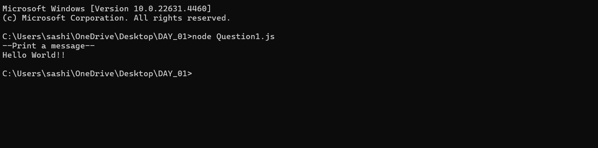
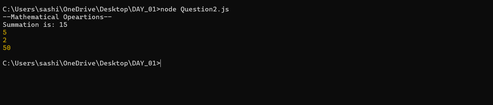
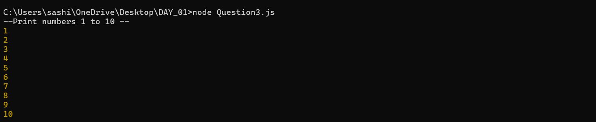
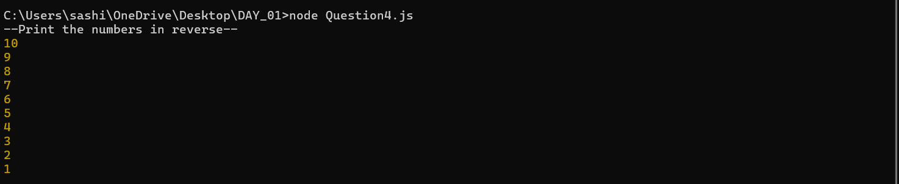

| Codes | Output |
|-------|--------|
|['Question1.js'](./codes/Question1.js)||
|['Question2.js'](./codes/Question2.js)||
|['Question3.js'](./codes/Question3.js)||
|['Question4.js'](./codes/Question4.js)||

