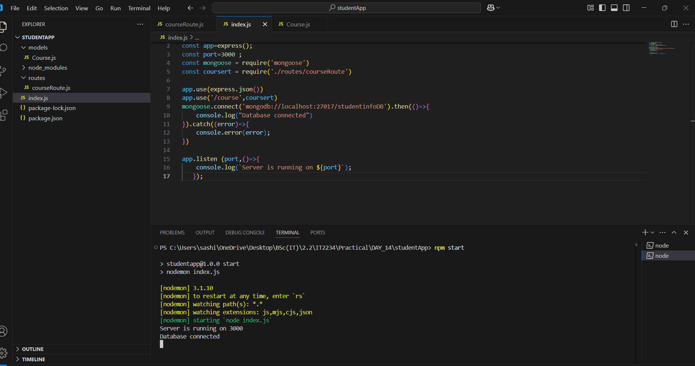
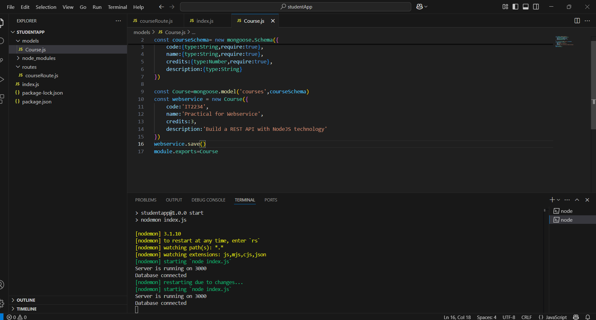

##✅ 1. INSERT 

Method: POST

Body (raw > JSON):

~~~
router.post('/',async(req,res)=>{
    try{
        const {code,name,credits,description} = req.body
        if(!code || !name || !credits){
              res.status(400).send("Please provide the required fields!")
        }else{
            const results = await Course.create({code,name,credits,description})
            res.status(200).json(results)
        }
    }catch (error){
        console.error(error);
        res.status(500).send("Sever error !")
    }
    
})
~~~

 

 

✨ Required fields are manatory for the given outputs.Otherwise errors will occur.

##✅ 2. UPDATE

Method: PUT

Body (raw > JSON):

~~~
router.put('/:id',async(req,res)=>{
    try{
        const id = req.params.id
        if(!mongoose.Types.ObjectId.isValid(id)){
            return res.status(400).send("Invalid ID !")
        }
        const ucourse =  await Course.findById(id)
        const {code,name,credits,description} = req.body
        if(!code || !name || !credits){
              res.status(400).send("Please provide the required fields!")
        }else{
            const results = await ucourse.updateOne({code,name,credits,description})
            res.status(200).json(results)
        }
    }catch (error){
        console.error(error);
        res.status(500).send("Sever error !")
    }
    
})
~~~

##✅ 3. DELETE

Method: DELETE

Body (raw > JSON):

~~~
router.delete('/:id',async(req,res)=>{
    try{
        const id = req.params.id
        if(!mongoose.Types.ObjectId.isValid(id)){
            return res.status(400).send("Invalid ID !")
        }
        const dcourse =  await Course.findById(id)
        const {code,name,credits,description} = req.body
        const results = await dcourse.deleteOne(dcourse).catch(
            (error)=>{ return res.status(500).json(error)}
        )
        res.status(200).json(results)
        
    }catch (error){
        console.error(error);
        res.status(500).send("Sever error !")
    }
    
})
~~~

| Codes | Outputs|
|-------|--------|
|['index.js'](./Codes/index.js)||
|['Course.js'](./Codes/Course.js)||

